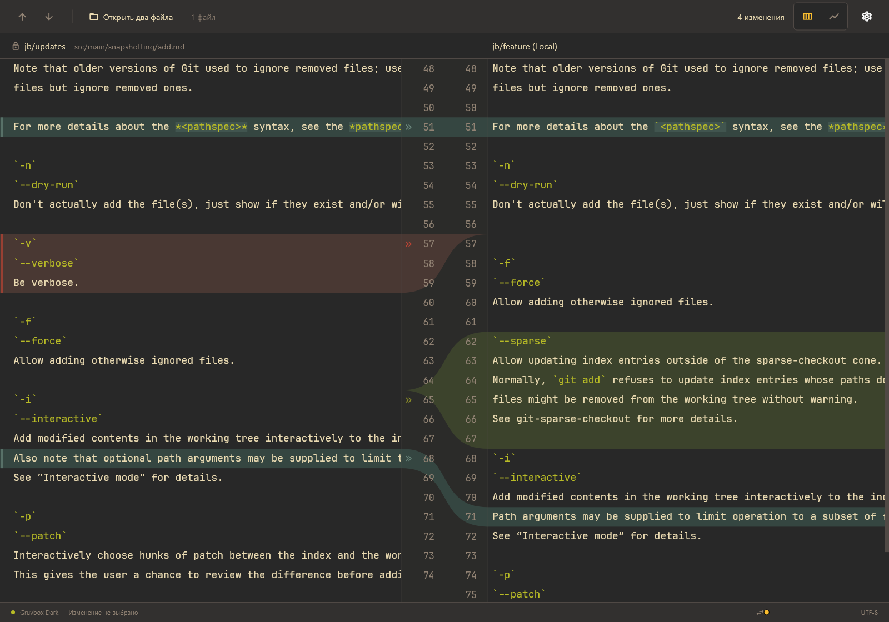

# Flutter Git Diff · Gruvbox

Графический Windows-прототип двухпанельного просмотра изменений, по мотивам исходного скриншота. Тёмная Gruvbox, независимые номера строк, цветные диапазоны, настоящие заполненные кривые Безье со сглаживанием, подсветка Markdown и навигация между изменениями. Соединения рисуются Flutter Canvas, графические протоколы терминала не нужны.



## Запуск

```powershell
cd C:\Users\vostr\code\git-diff-curves-flutter-demo
flutter pub get
flutter run -d windows
```

Готовая сборка после `flutter build windows --release`:

```powershell
.\build\windows\x64\runner\Release\git_diff_curves_flutter_demo.exe
```

Для переноса программы копируйте **весь каталог Release**, включая DLL и `data`, а не только EXE. Нужны системные библиотеки Visual C++.

## Управление

- По умолчанию открывается пример `add.md`, повторяющий расположение четырёх блоков исходного скриншота.
- «Открыть два файла» / Ctrl+O: сначала выбрать исходный файл, затем новый. Файлы только читаются.
- Стрелки в панели / F7 и Shift+F7: следующий и предыдущий блок, циклически.
- Колесо мыши / полоса справа: общая вертикальная прокрутка.
- Нижний ползунок: общая горизонтальная прокрутка текста; номера строк остаются на месте.
- Две кнопки справа в панели: заполненные переходы / только контуры.
- Настройки: размер текста и возвращение к исходному примеру.

## Проверки

```powershell
flutter analyze
flutter test
flutter build windows --release
```

Для сохранения кадра самого Flutter-интерфейса во время теста на Windows:

```powershell
$env:DIFF_PREVIEW_OUTPUT = Join-Path $PWD 'flutter-preview.png'
flutter test test/widget_test.dart
Remove-Item Env:\DIFF_PREVIEW_OUTPUT
```

## Ограничения прототипа

Поддерживаются два текстовых UTF-8 файла; прямого чтения Git-репозитория нет. Построчный LCS ограничен 8 млн ячеек и выполняется отдельно от интерфейса на Windows. При неоднозначных пустых строках реальные сравнения могут группировать блоки иначе, чем подготовленный пример. Конечный перевод строки не считается отдельным изменением. Текст рисуется на Canvas: выделение/копирование и редактирование пока не реализованы. Горизонтальный ползунок ограничен 1600 пикселями. Рекомендуемый размер окна — от 1000×700.

Проект также содержит web-платформу (`flutter run -d chrome`), но проверенная поставка — Windows.

Текст использует [JetBrains Mono](https://github.com/JetBrains/JetBrainsMono), лицензия OFL находится в `assets/fonts/OFL.txt`. Диалоги открытия файлов используют [file_selector](https://pub.dev/packages/file_selector), кривые — [CustomPainter](https://api.flutter.dev/flutter/rendering/CustomPainter-class.html).
